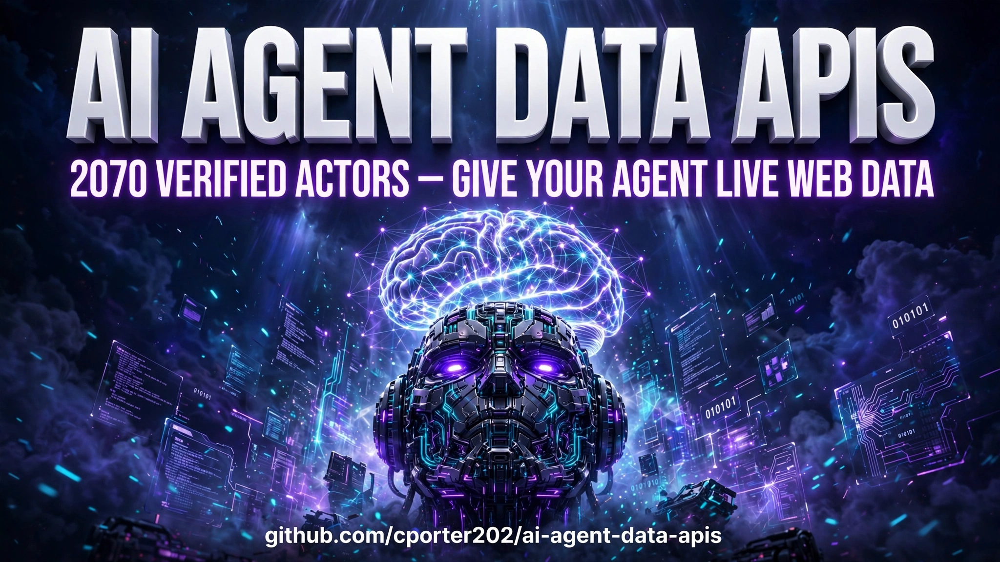

 

# 🤖 AI Agent Data APIs

**Give your AI agent live web data. 2,070 actors for MCP servers, LLM tools, RAG pipelines, browser automation, vision, and voice — powered by production-ready Apify actors.**

  <a href="catalog/README.md"><strong>🔍 Browse the Actor Catalog</strong></a> ·
  <a href="#-start-with-a-job-to-be-done"><strong>🚀 Start Building</strong></a> ·
  <a href="https://apify.com?fpr=p2hrc6"><strong>⚡ Try Apify Free</strong></a>

## 📖 What this repo is

A mega directory of **2,070 AI agent data APIs** — everything an AI agent needs to touch the live web. MCP servers it can call directly, browser actors that read any page, RAG pipelines for knowledge bases, vision and voice models, LLM utilities. Every actor is a ready-to-run [Apify](https://apify.com?fpr=p2hrc6) worker your agent can invoke as a tool.

The main content of this repository:

- [🔍 Browse the actor catalog](catalog/README.md) — 2,070 actors across MCP servers, LLM tools, RAG, live web data, vision, and voice.

| Coverage snapshot | This directory |
|---|---:|
| 🤖 Verified AI actors | **2,070** |
| 🔌 MCP servers | **170** |
| 🧠 LLM & chatbot actors | **120** |
| 📚 RAG & knowledge bases | **56** |
| 🌐 Live web data for agents | **496** |
| 👁️ Vision, image & video AI | **252** |
| 🎙️ Voice & transcription | **107** |
| Starting cost | **Free tier + pay-per-result** |

## 🎯 Start with a job to be done

| If you need to… | Start here |
|---|---|
| 🔌 Let Claude/Codex call web tools directly | [Agent + MCP playbook](playbooks/agent-mcp-setup.md) |
| 📚 Build a RAG knowledge base from any website | [RAG pipeline playbook](playbooks/rag-pipeline.md) |
| 🌐 Give an agent a live browser | [Actor catalog](catalog/README.md) → live web data |
| 🧠 Add LLM, vision, or voice capabilities | [Actor catalog](catalog/README.md) → matching section |

## 🛠️ Common build paths

- **🔌 Agent + MCP setup** — connect an Apify MCP server to Claude or Codex and let the agent call scrapers as tools. The [playbook](playbooks/agent-mcp-setup.md) walks through it.
- **📚 RAG pipelines** — crawl any site, chunk it, embed it, query it. The [playbook](playbooks/rag-pipeline.md) builds one end to end.
- **🌐 Live-data agents** — agents that check prices, monitor pages, and research the web on their own schedule.
- **🎙️ Voice + vision agents** — transcribe calls, analyze images, generate media — all as callable actor tools.

## 🌟 Featured categories

| Category | Why it matters |
|---|---|
| [MCP servers](catalog/README.md) | Agents discover and call these directly — no integration code |
| [Live web data](catalog/README.md) | 496 browser actors: the agent's eyes on the live web |
| [RAG & knowledge](catalog/README.md) | Turn any website into a queryable knowledge base |

[See all 2,070 in the catalog →](catalog/README.md)

## ❓ Why actors instead of raw APIs

AI agents need tools, not docs. Every actor here is already a callable unit with defined inputs and JSON outputs — and through Apify's MCP server, MCP-compatible agents can discover and invoke them with zero glue code. You skip the integration work and go straight to the agent logic.

  <a href="https://apify.com?fpr=p2hrc6"><strong>⚡ Get started on Apify (free tier) →</strong></a>

## 🤝 Contributing

Found an AI agent actor that belongs here? Open a PR adding it to `catalog/README.md` with a verified `apify.com` URL and a one-line description. Only actors confirmed live on the Apify Store, please.

## 📢 Disclosure

Links to Apify in this repo include my affiliate code (`fpr=p2hrc6`). You pay exactly the same price — it supports keeping this directory updated and verified.

## 📄 License

MIT — see [LICENSE](LICENSE).
